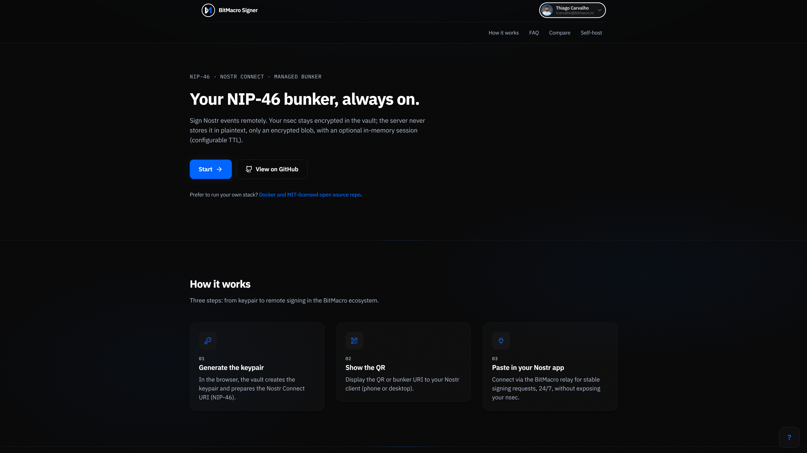
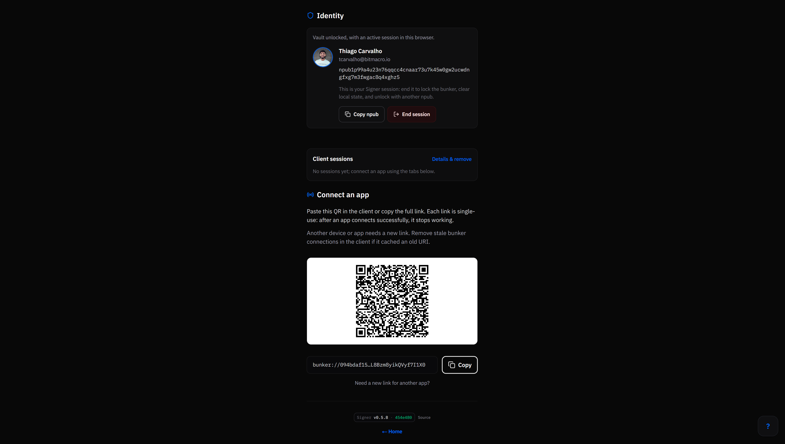
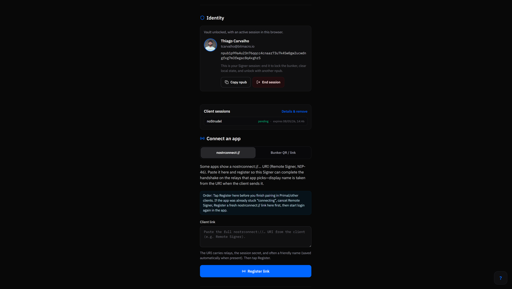
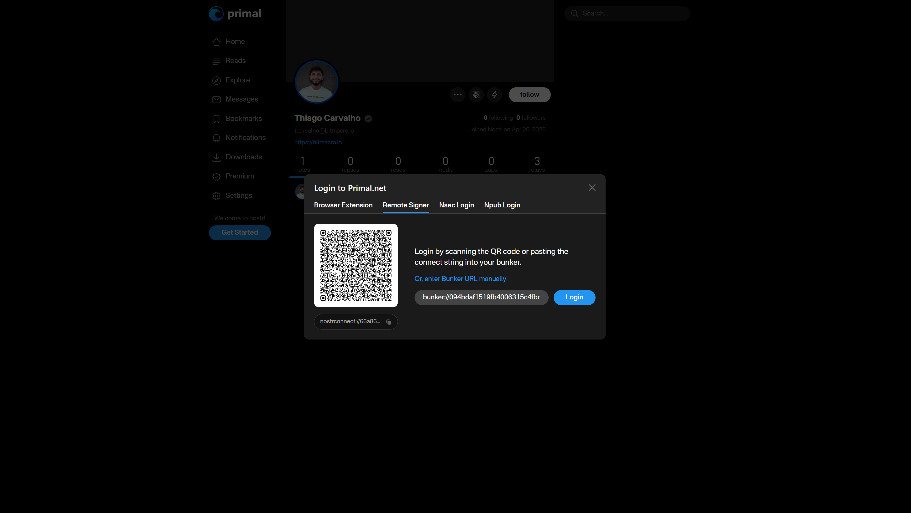

# @bitmacro/bitmacro-signer

[](https://github.com/bitmacro/bitmacro-signer/actions/workflows/ci.yml)
[](https://github.com/bitmacro/bitmacro-signer/blob/main/vitest.config.ts)
[](https://github.com/bitmacro/bitmacro-signer/actions/workflows/web.yml)
[](https://github.com/bitmacro/bitmacro-signer/actions/workflows/daemon.yml)
[](https://github.com/bitmacro/bitmacro-signer)
[](https://opensource.org/licenses/MIT)
[](https://www.typescriptlang.org/)
[](https://nodejs.org/)

**[→ BitMacro Signer (site)](https://signer.bitmacro.io)**  
**[→ BitMacro: bitmacro.io](https://bitmacro.io)**

**BitMacro Signer** is the product name; the npm package is **`@bitmacro/bitmacro-signer`**. Next.js app for a **managed NIP-46 bunker**: store `nsec` as an encrypted blob (AES-GCM via Web Crypto on the client), run a **NIP-46** signing loop over the configured relay (e.g. **`wss://relay.bitmacro.cloud`** for open testing, **`wss://relay.bitmacro.io`** for the private relay with whitelist), and keep decrypted material in server RAM only during an active session with a configurable TTL — the server never sees `nsec` in plaintext at rest.

**SDK (shared client logic):** [@bitmacro/relay-connect](https://www.npmjs.com/package/@bitmacro/relay-connect) · [relay-connect](https://github.com/bitmacro/relay-connect)

| Package | Role |
| ------- | ---- |
| `@bitmacro/bitmacro-signer` | This repo — bunker UI + server (Next.js App Router) |
| `@bitmacro/relay-connect` | NIP-46 / NIP-07 TypeScript SDK (BitMacro Connect) |

---

## Screenshots



*Signed-in panel: vault status, bunker relay, and signing session actions (`bunker://` and `nostrconnect://`).*



*Bunker / NIP-46 context: relays, session registration, and bunker listening state.*



*Client connection flow: paste or register a client URI, confirm relay list, pairing guidance.*



*End-user experience in a Nostr client connected to the hosted bunker (signing without exposing `nsec`).*

---

## Status

**MVP in progress:** vault client-side (AES-GCM), API vault/sessions, auth cookies, onboarding, NIP-46 bunker loop (`bunker://` and **`nostrconnect://`** from **v0.5.0**) in a **daemon** process, GHCR images for `signer-web` and `signer-daemon`. Product semantics (NIP-46 session keys vs profile `npub`, one-time bunker secrets, optional session labels, client relay URLs) are documented in [bitmacro-docs `03-produtos/signer.md`](https://github.com/bitmacro/bitmacro-docs/blob/main/03-produtos/signer.md).

## Install

```bash
npm install @bitmacro/bitmacro-signer
```

*(Publishing and version cadence will follow the same approach as other `@bitmacro/*` packages.)*

## Usage

The app combines **`nostr-tools`**, **`@bitmacro/relay-connect`**, Supabase, and Zod; self-host via Docker is supported (see below). For **operator-facing** behaviour (bunker URI, sessions, relay), prefer the [Signer product doc](https://github.com/bitmacro/bitmacro-docs/blob/main/03-produtos/signer.md) in `bitmacro-docs`.

```bash
cp .env.example .env
# Set at minimum NEXT_PUBLIC_SUPABASE_URL, NEXT_PUBLIC_SUPABASE_ANON_KEY, NEXT_PUBLIC_APP_URL
# For the NIP-46 daemon (self-host): DAEMON_INTERNAL_TOKEN, RELAY_URL (or NEXT_PUBLIC_RELAY_URL), SUPABASE_SERVICE_ROLE_KEY; signer-web adds DAEMON_INTERNAL_URL when calling the daemon over Docker
docker compose up --build
```

Compose defines **`web`** (Next on port **3000**, health check `GET /api/health`) and **`daemon`** (bunker loop — see `Dockerfile.daemon` and `src/daemon/index.ts`).

**MVP (self-host):** the daemon holds NIP-46 signing state **in RAM** only. After a **daemon container restart** (recreate, deploy, crash), users must **unlock again** in the Signer UI — there is no automatic bunker restore on cold start. Product docs: [bitmacro-docs signer product doc](https://github.com/bitmacro/bitmacro-docs/blob/main/03-produtos/signer.md) *(expected MVP behavior)*.

### Web image on GHCR (Next.js standalone)

[`.github/workflows/web.yml`](.github/workflows/web.yml) builds **`linux/amd64`** from [`Dockerfile`](Dockerfile) and pushes (version = [`package.json`](package.json) `version`):

- `ghcr.io/bitmacro/bitmacro-signer-web:latest`
- `ghcr.io/bitmacro/bitmacro-signer-web:<semver>` (e.g. `0.2.0`)
- `ghcr.io/bitmacro/bitmacro-signer-web:<short-sha>`

Runs on `push` to `main` when listed paths change (incl. `src/**`). Edits confined to `src/daemon/` still match `src/**`, so the web image workflow may run in parallel with the daemon workflow — redundant but harmless. GitHub Actions does not allow `paths` and `paths-ignore` on the same trigger.

### Daemon image on GHCR (self-host)

On every push to `main` that touches `src/daemon/**`, `src/lib/**`, `Dockerfile.daemon`, or `package.json`, [`.github/workflows/daemon.yml`](.github/workflows/daemon.yml) builds **`linux/amd64`** and pushes to:

- `ghcr.io/bitmacro/bitmacro-signer-daemon:latest`
- `ghcr.io/bitmacro/bitmacro-signer-daemon:<semver>` (matches `package.json`)
- `ghcr.io/bitmacro/bitmacro-signer-daemon:<short-sha>` (7-character Git commit SHA)

Image labels include `org.opencontainers.image.version` (inspect with `docker inspect`).

The workflow run logs include the **image digest (SHA-256)** after a successful push.

**Pulling the image:** If the GHCR package visibility is **public** (default for many public repos), `docker pull ghcr.io/bitmacro/bitmacro-signer-daemon:latest` often works **without** logging in. If the package is **private** or pull fails with “denied”, authenticate once:

```bash
echo YOUR_GITHUB_PAT | docker login ghcr.io -u YOUR_GITHUB_USERNAME --password-stdin
```

- PAT needs **`read:packages`** (and **`write:packages`** only if this machine also pushes images).

**Previously private repos:** After making the GitHub repo public, open **Packages → bitmacro-signer-daemon → Package settings** and set visibility to **public** if you want anonymous pulls on the server.

**Pull and run** (example):

```bash
docker pull ghcr.io/bitmacro/bitmacro-signer-daemon:latest
# Configure env (see .env.example): DAEMON_INTERNAL_TOKEN, Supabase, RELAY_URL / NEXT_PUBLIC_RELAY_URL, etc.
docker run --env-file .env ghcr.io/bitmacro/bitmacro-signer-daemon:latest
```

### Observability (Grafana / Loki)

Both **signer-web** and **signer-daemon** can push JSON log lines to **Loki** over HTTP when **`LOKI_HOST`**, **`LOKI_USER`**, and **`LOKI_PASSWORD`** are set (see [`.env.example`](.env.example)).

- **Web** uses the default `BITMACRO_LOG_SERVICE` / `bitmacro-signer` label and may add `{subsystem="signer-web-api"}` on route-level events (e.g. successful **nostrconnect** session registration).
- **Daemon** sets **`BITMACRO_LOG_DAEMON_SERVICE`** (default **`bitmacro-signer-daemon`**) and stream labels **`subsystem=signer-daemon`**, **`source=relay-connect-sink`** for every relay-connect / NIP-46 related line; context is **sanitized** (no `content` / token-like fields, long strings truncated).

Example **LogQL** in Grafana Explore:

```logql
{service_name="bitmacro-signer-daemon"} |= `relay-connect`
{service_name="bitmacro-signer-daemon"} | json | event="nip46_idle_no_inbound"
{service_name="bitmacro-signer"} | json | event="nostrconnect_registered"
```

**`RELAY_CONNECT_LOG_MIN_LEVEL`** on the daemon defaults to **`debug`** for maximum NIP-46 visibility; set **`info`** if the volume is too high.

### Troubleshooting (operators)

- **relay-api / panel — no NIP-46 in HTTP logs:** Signing clients open a **WebSocket** to the relay host (e.g. `wss://nip46.bitmacro.io` or `wss://relay.bitmacro.cloud`). That path **does not** pass through **relay-api**; only the Relay Manager **agent** talks to relay-api. Use **Loki** on **signer-daemon** (`NIP-46 inbound`, `nip46_idle_no_inbound`, subscribe snapshot) instead.
- **Relay Manager → Eventos empty on “Relay NIP-46 VPS”:** The header **WebSocket** line is the **`relay-agent` base URL** (`https://…relay-agent…` / management), not the public `wss://` clients use. Eventos are read from **strfry** via the agent. If you clicked **“Meus eventos”**, the request adds `authors=<your npub hex>`; **kind 24133** NIP-46 messages are usually authored by the **remote app** key, **not** your profile pubkey — the table looks empty even when the relay has traffic. Clear the author field, widen the time range (“Todas”), pick **kind 24133** in the kind filter, or category **“Todos” / “Replaceable”**.
- **Test bunker on the public relay:** On **bitmacro-server** `docker-compose`, set both to the same URL, recreate **signer-web** and **signer-daemon**, then **unlock** and issue a **new** `bunker://` / session (old QR still points at the previous relay):

  ```bash
  SIGNER_DAEMON_RELAY_URL=wss://relay.bitmacro.cloud
  ```

  Compose already sets **`BUNKER_RELAY_URL=${SIGNER_DAEMON_RELAY_URL:-…}`** on signer-web so the bunker URI matches.

## Development

```bash
npm install
npm run dev
npm run build
npm run lint
```

`npm run dev` uses **Turbopack** (`next dev --turbopack`).

### Tests and coverage

```bash
npm run test            # Vitest (no coverage report)
npm run test:coverage   # CI command: tests + v8 → coverage/lcov.info, coverage/index.html
```

CI runs **`npm run test:coverage`** and uploads **`coverage/lcov.info`** as a workflow artifact for inspection.

Coverage is **scoped to library code** under `src/lib` (vault, session / NIP-46 URI parsing, bunker helpers, Zod schemas, backup utilities, session cookie helpers), not the full Next.js UI or every API route. That keeps the percentage meaningful for crypto and session logic; use manual or E2E checks for deploy behaviour.

### i18n emit (`npm run i18n:emit`)

Do **not** run `npm run i18n:emit` until the `recover.*` and `onboarding.backup.*` namespaces are wired into `buildMessages()` in [`scripts/i18n-emit.mjs`](scripts/i18n-emit.mjs). The script overwrites `src/messages/{en,pt-BR,es}.json` and would remove those translations. Prefer editing the JSON files directly until that work is done. See the comment at the top of `i18n-emit.mjs`.

## Contributing

Issues and pull requests are welcome — NIP-46 flows, security hardening, and operator UX.

This project is maintained by [BitMacro](https://bitmacro.io).

## Contributors

<a align="center" href="https://github.com/bitmacro/bitmacro-signer/graphs/contributors">
  
</a>

---

## License

MIT. See [LICENSE](LICENSE).
